<!-- hero: monochrome ASCII portrait (types in) beside a neofetch-style info
     panel. regenerate portrait: node scripts/make_ascii_svg.js ;
     info panel: node scripts/make_info_card.js -->
<table>
<tr>
<td valign="top"></td>
<td valign="top"></td>
</tr>
</table>

## Husam Moussa

**Founder @ Atmosphere · Full-Stack Developer · EdTech Builder**

 

<!-- animated contribution graph: real data, boxes reveal cell by cell
     (regenerated daily by .github/workflows/update-profile-art.yml) -->

